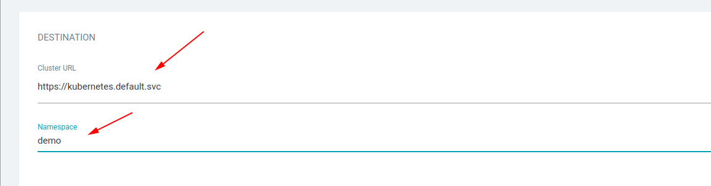
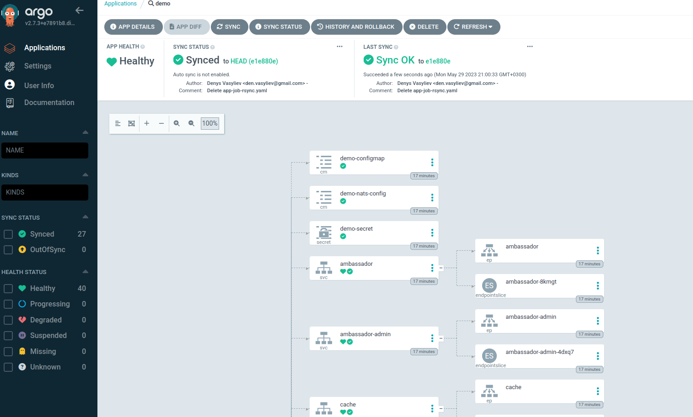

## Connect the repository to ArgoCD

1. Add a new application:


2. Add an application name and select a project. Also check the "AUTO-CREATE NAMESPACE" checkbox:


3. Under "SOURCE", insert the url of the repository you want to track:


4. In Destination choose Cluster URL by default and write name of namespace:



5. After clicking the "CREATE" button, you will see the application that needs to be synchronized. Click on the "SYNC" button:


6. After synchronizing the application, you can see the health status of the cluster




Now when changes are made to the repository, the changes will apply to the cluster

---
### Checking a deployed application 
1. Create a port-forward to the service for access from localhost:

```bash
kubectl port-forward -n demo svc/ambassador 8088:80 &
```

2. Download any image. Example google logo:

```bash
wget -O /tmp/g.png https://www.google.com/images/branding/googlelogo/1x/googlelogo_color_272x92dp.png
```

3. Send the image to a service:

```bash
curl -F 'image=@/tmp/g.png' localhost:8088/img/
```

Result:


