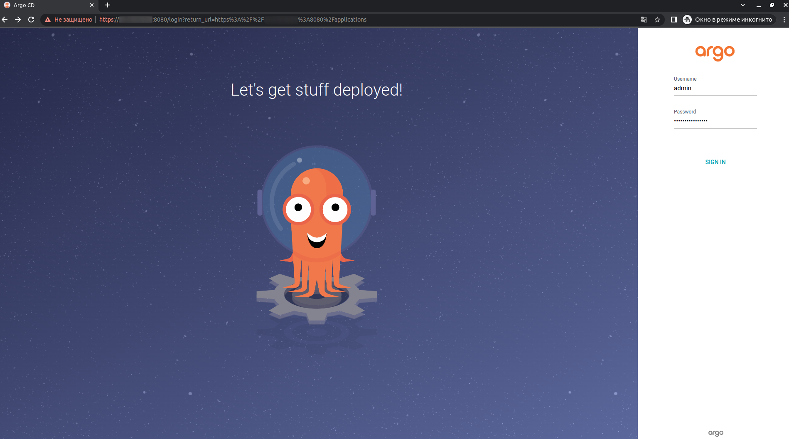
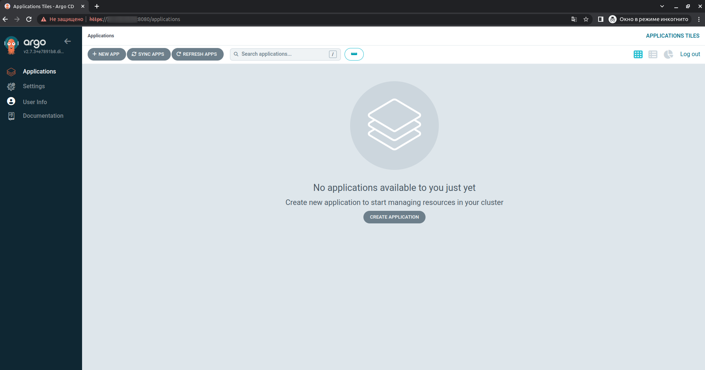

# Installing ArgoCD in k3d cluster

**ArgoCD** is a popular open-source continuous delivery tool for Kubernetes that automates deployment of applications, monitors their state, and provides a web-based UI and CLI for managing and deploying applications across multiple clusters and environments.

Installation
---

1. Create a cluster using k3d:
```bash
k3d cluster create argocd-cluster
```
2. Deploy AgroCD in the 'argocd' namespace:
```bash
kubectl create namespace argocd
kubectl apply -n argocd -f https://raw.githubusercontent.com/argoproj/argo-cd/stable/manifests/install.yaml
```
3. Waiting for AgroCD to deploy. Check that all pods are running:
```bash
kubectl get pods -n argocd
```
4. Using port forwarding, access the ArgoCD interface through your browser:
```bash
kubectl port-forward svc/argocd-server -n argocd --address 0.0.0.0 8080:443 > /dev/null&
```
5. You can get the administrator password with the command:
```bash
kubectl -n argocd get secret argocd-initial-admin-secret -o jsonpath="{.data.password}" | base64 -d; echo
```
6. In the browser you must enter https://ip-address:8080. Usaname: `admin`




